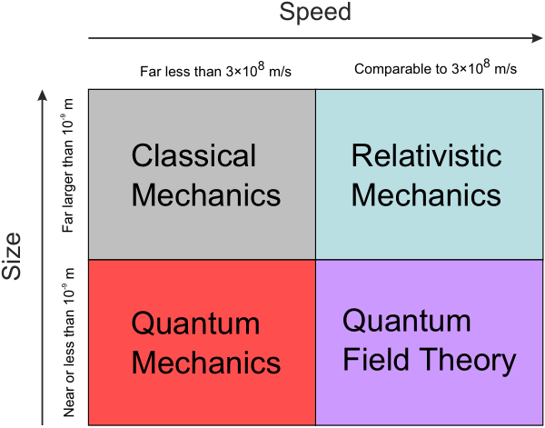

# Results and Discussion

The relativistic theory works much better than the classical theory (compare @sec:intro).
In @Fig:theories some concepts are shown that might or might not our findings.

{#fig:theories}
