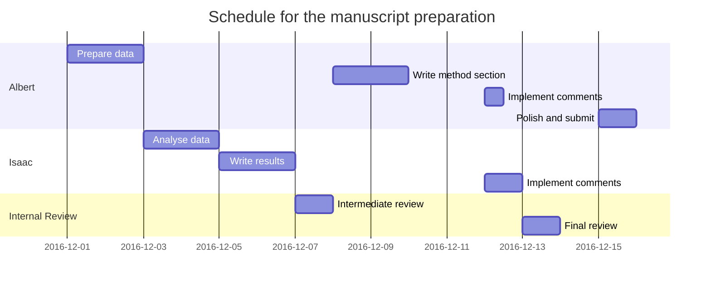

# Gantt

```mermaid
gantt    
    dateFormat  YYYY-MM-DD
    title Schedule for the manuscript preparation

    section Albert
    Prepare data            : A1, 2016-12-01, 2d
    Write method section    : A2, 2016-12-08, 2d
    Implement comments      : A3, 2016-12-12, 12h
    Polish and submit       : A4, 2016-12-15, 1d

    section Isaac
    Analyse data            : B1, after A1, 2d
    Write results           : B2, after B1, 2d
    Implement comments      : B3, 2016-12-12, 1d

    section Internal Review
    Intermediate review     : I1, after B2, 1d
    Final review            : I2, after B3, 1d
```

## Other Tasks

- [x] Tidy up desktop
- [ ] Prepare submission party

